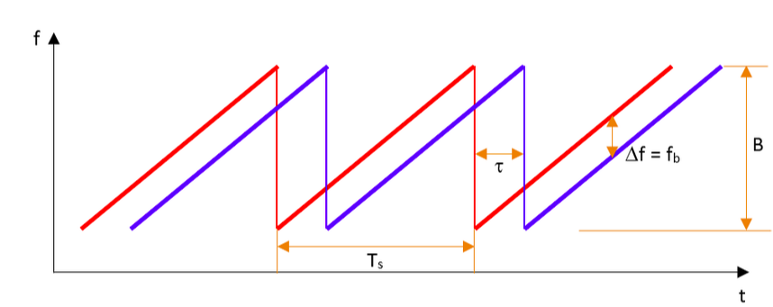
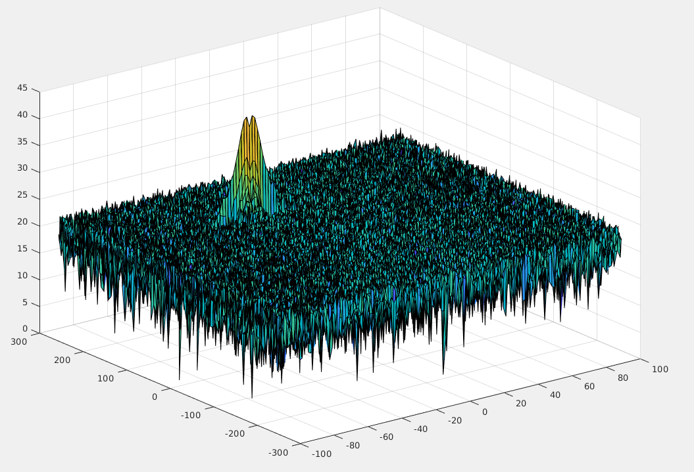
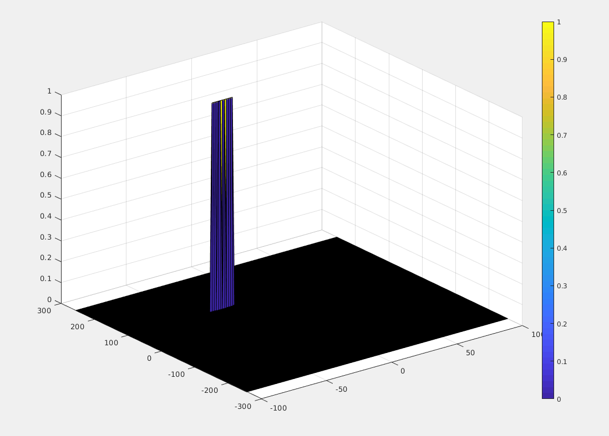

# Distance and velocity calculation of moving target from radar signals
Contains operations to measure distance an velocity by using radar readings.

## Radar specification:
Frequency of operation = 77GHz
Max Range = 200m
Range Resolution = 1 m
Max Velocity = 100 m/s

## Frequency Modulated continuous wave (FMCW)
 

## Signal generation to simulate target
Simulated target has a initial distance of 100m and a veloity of -30m/s

## Range and doppler response calculation
Using 2D-FFT

 

## CFAR implementation
2D-CFAR to remove false detections

1) Define the number of guard and training cells (Tr=8, Td=4, Gr=4, Gd=2, offset_threshold=7)

2) Iterate over the 2D array to calculate noise level 

2A) Filter Threshold is noise level + offset

2B) Assign 0 to the readings under the filter threshold and 1 to the others

## Plotting the final output
 
